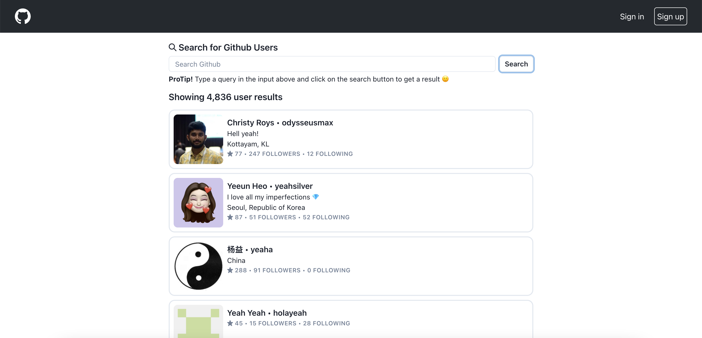

# GitHub User Search

An application that re-implements a portion of GitHub's Search feature (the user search), using their public API and displays important user information in a card.



## Getting Started

These instructions will get you a copy of this project up and running on your local machine for development and testing purposes.

### Installing

- Open your local development terminal
- `cd` into the directory that you want the project to reside e.g:

```
cd projects
```

- Clone the repository into that directory

```
git clone https://github.com/lumie31/GitHubUserSearch.git
```

- Run `npm install` to install the project dependencies
- Run `npm start` to start a local development server
- Navigate to http://localhost:3000 to view the project

## Live Demo

A fully functional demo of this project is hosted on Netlify and is available here: https://github-user-srch.netlify.app/

## Built With

- [React.js](https://www.reactjs.org) - Javascript library for building user interfaces
- [Chakra UI](https://www.chakra-ui.com) - A simple component library for building React apps
- [Netlify](https://www.netlify.com) - For easy deployment of web apps
- [GraphQL API Explorer](https://docs.github.com/en/graphql/overview/explorer) - For testing Graphql queries
- [Apollo Client](https://www.apollographql.com/docs/react/) - Apollo Client is a comprehensive state management library for JavaScript that enables you to manage both local and remote data with GraphQL

## General Comment

_Highlight something in your project that you thought was especially interesting or significant to your overall implementation._

> Working with the GraphQL version of the Github API made my overall implementation seamless. For some particular responses like the total count of a user's following, followers, starred repositories etc., the REST API version would require me to make several API calls because the "search users" endpoint returned those data as a URL as opposed to the count.

_Tell us about what you are most pleased or proud of with your implementation._

> I'm proud of how I was able to figure out working with the GitHub GraphQL API in a short time.

_Given more time, what would the next feature or improvement you would like to add to your project?_

> Given more time, I would add tests to my implementation and improve the overall developer experience by using Typescript.
